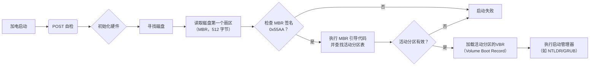
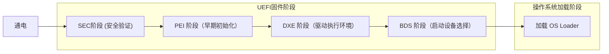

# 十分钟看懂系统启动

重装系统系列教程补充

按下空格键或→键以翻到下一页

---
section: 'TOC'
hideInToc: true
---

# 内容一览

<Toc />

---
section: '分区与分区表'
layout: two-cols-header
---

# 分区: 国王与分封土地

A 王国是[地球 🌍](https://zh.wikipedia.org/wiki/%E5%9C%B0%E7%90%83) 上最为强大的国家之一，位于赤道附近。然而由于南北受到外敌入侵，王国的土地不断被侵蚀，国土最终变成了一整条宽度完全相同，长度固定的线段，且**首尾不构成环**。

现在国王 🤴 要为诸侯 👨 分封土地，不幸的是，由于国土现在奇葩的形状，必须要使得划分方案满足以下几个条件：

::left::

- 为了方便起见，国王下令只允许划分国土的长度，而不能划分宽度，于是整块国土变为一个**线性结构**
- 整块国土被划分成 $n$ 等份，封地*以国土长度的 $\frac{1}{n}$ 为单位进行划分*
  + 整块国土可以表示为 $[1, n]$
  + 任意一块封地可以表示为 $[s,t]\enspace 1\le s,t\le n$
- 国王身为一国之首，为了体现自己的尊贵，宣布在国土开头部分的某些区域建造城堡，并负责处理所有封地事宜
  + 城堡占用的区域可以表示为 $[1, x]\enspace x<n$

受封的诸侯对自己的封地形成长期占有关系，未经允许，不得擅自更改自己的封地范围

::right::

衣着品味比较奇怪的国王

---
hideInToc: true
---

# 分区: 国王与分封土地 (cont'd)

- 计算机的磁盘 💾 也是一个<b>线性结构</b> 📏，好比是 A 王国的整块国土
- 分区就是国土上被划分出来的一个个封地 (封地)，划分分区的最小单位就是<em>扇区</em>
- 分区有着自己的**额外信息**：
  - 分区的大小、具体占用的是哪些扇区；分区属于谁？分区也会像诸侯的封地一样，有着自己的名称...
  - 居住在城堡 🏰 里的国王负责管理所有封地信息，而磁盘也有自己的国王——<b>分区表</b> 📄

---
layout: iframe-left
url: "https://web.archive.org/web/20130322172831/http://www.uefi.org/learning_c\
  enter/UEFI_MBR_Limits_v2.pdf"
---

# 分区表: 国王记录封地的小本本

国王就算记性再好，也不可能时时刻刻记住所有封地的信息，因此他有一个专门记录封地信息的小本本 📒，无论是封地的添加、删除、修改，都在这个小本本上完成

对应到磁盘上，国王的小本本就被称为[分区表](https://zh.wikipedia.org/zh-hans/%E5%88%86%E5%8C%BA%E8%A1%A8)  📓(Partition Table)，我们常使用的分区表有两种类型：

- <b>主引导记录</b>，即 MBR (Master Boot Record)
  + 👴 较古老，在老电脑上使用最多
  + 与 <b>Legacy 启动方式 (BIOS 启动)</b> 搭配使用
  + 有很多不适应现代操作系统的设计：
    - 单个分区最大为 2 TB ⚠️ (实际上，西数和希捷等厂商使用了一些 ["unofficial techniques"](https://askubuntu.com/a/157000/1937372) 使得能够略高于这个上限)
    - 将分区分为**主分区** (可启动操作系统的分区) / **拓展分区**两类，最多只有 4 个主分区
  + 不仅管分区，还要管启动

---
hideInToc: true
---

# GPT

- <b>GUID 分区表</b>，即 GPT (GUID Partition Table)
  + 是对 MBR 的拓展和延伸 📏，同时作为 [<b>UEFI</b>](https://zh.wikipedia.org/zh-hans/%E7%B5%B1%E4%B8%80%E5%8F%AF%E5%BB%B6%E4%BC%B8%E9%9F%8C%E9%AB%94%E4%BB%8B%E9%9D%A2) 标准的一部分
  + 与 UEFI 启动方式搭配使用
  + 摒弃了 MBR 的一些不良设计
    - 不再区分主分区和拓展分区，所有分区都可以启动操作系统 (但具体流程和 MBR + Legacy 有较大区别)
    - 不再限制分区数量 (严格意义上说仍有限制，[Windows 对 GPT 最大的分区个数限制为 128 个](https://learn.microsoft.com/zh-cn/windows-hardware/manufacture/desktop/windows-and-gpt-faq?view=windows-11#gpt-----------))
  + 兼容了部分 MBR 功能 (即 [<em>CSM</em>](https://en.wikipedia.org/wiki/UEFI#CSM_booting))；通常情况下 GPT 分区表只负责分区，不负责启动相关
  + <b>为每一个分区都分配了一个独一无二 👍 的 UUID</b>
    - 在理想情况下，全球范围内的电脑上都不会存在两个 [UUID](https://zh.wikipedia.org/wiki/%E5%85%A8%E5%B1%80%E5%94%AF%E4%B8%80%E6%A0%87%E8%AF%86%E7%AC%A6) 相同的磁盘分区
    - 离线算法，无需联网 🌐
  + 一个<a href=https://www.guidgenerator.com>在线 GUID 生成器</a>

<Item title="思考">
什么是 BIOS？什么又是 UEFI？MBR 真的只能和 Legacy (BIOS) 一起使用吗？GPT 和 UEFI 呢？
</Item>

---
section: "固件与启动管理器"
layout: two-cols-header
---

# BIOS

对于国家和军队来说，千军万马 🪖🐎 并非一人可以掌控，如果没有完善的军事制度，那么无论有多少士兵和武器，也是不堪一击

对于计算机系统来说，管理和利用各项设备资源是永恒的主题...

::left::

- 计算机有着很多的<b>资源</b>
  + ⚡ CPU、NPU、显卡、内存等<em>计算资源</em>
  + 💾 硬盘、U 盘、软盘、DVD 等<em>存储资源</em>
  + 🪭 机箱风扇、CPU 风扇等<em>散热资源</em>
  + 💡 视频采集卡、外接的各种 USB 设备、内存条灯条...

<Item title="提示">
请注意：很多资源都是 <em>OS-independent</em> 的，这意味着在没有加载任何操作系统的情况下，你必须对它们拥有基础的访问权限，例如硬盘、CPU、内存和各种风扇。也就是说，在载入操作系统前，你必须拥有<b>探测</b>到这些硬件的能力，并能够完成<b>最基本的各种操作</b>
</Item>

::right::

x86 的起点，Intel 8086
  

芝奇 DDR5 幻峰戟内存条

---
layout: two-cols-header
hideInToc: true
---

# BIOS (cont'd)

<b>BIOS</b>，即基本输入输出系统 (Basic I/O System)，是计算机上最基础的硬件管理系统 📺

::left::

AMI BIOS 的 ROM 芯片

- 位于主板上的 ROM (只读存储) 芯片上
- 开机时探测各种系统硬件：有没有独立显卡？有没有硬盘？有几个？CPU 支持什么功能？
  + 当你开机时插入 WinPE 启动盘，BIOS 也会探测到这个 "外来的" USB 设备 👾
- 硬件是检测到了，有没有故障，能不能正常用呢？——<em>自检</em> 😷
  + 还记得 BIOS 设置里面的 "快速启动" 吗？如果开启这项，就会跳过硬件自检

::right::

小时候常用电脑的人应该都见过的 AMI BIOS 界面
 <strike>你也可以在现在学校内某些老师的办公机上看到</strike>

---
layout: two-cols-header
hideInToc: true
---

# BIOS (cont'd)

如果你写过 8086 汇编，你一定知道 [<em>中断</em>](https://zh.wikipedia.org/wiki/%E4%B8%AD%E6%96%B7) (Interrupt)

- 没错，MS-DOS 中的普通程序是可以直接通过 BIOS 中断调用访问硬件资源的
- 现代操作系统中的应用程序转向使用更快的 [syscall](https://en.wikipedia.org/wiki/System_call)，仅在操作系统启动时使用 BIOS 中断
- BIOS 还需要负责操作系统的<b>启动</b>

使用 8086 汇编实现的<a href=https://pastebin.pl/view/f4144519>爬楼梯</a>程序, 版权属于<a href="https://web.archive.org/web/20240305044016/https://it.swufe.edu.cn/szdw/zj.htm">杨彬老师</a>

---

# Legacy 启动 (BIOS 启动) 流程 (略)

Legacy 启动流程图

当加电启动后，如果有多块硬盘，则 BIOS 程序首先按照 [CMOS](https://zh.wikipedia.org/wiki/BIOS#BIOS%E4%B8%8ECMOS%E7%9A%84%E5%85%B3%E7%B3%BB) 中的配置顺序依次扫描磁盘 (若未修改配置，则默认按照磁盘的物理接口次序检测)，直到遇见第一个具有 MBR 分区表的磁盘为止，读取 MBR 分区表 (磁盘的第一个扇区，大小为 512 字节)

- 还记得国王的城堡 🏰 吗？国王为了彰显自己的权威总是把城堡建在国土的前面几块地上
- MBR 签名是一个校验码 🔢，如果这一位不是约定俗成的值，则证明 MBR 分区表已经损坏，应当避免启动

<b>活动分区</b>是 MBR 主分区的一种特殊状态，这个分区内有相应的操作系统启动文件，并被打上了一个特殊的 `boot` 标记 🖊 (用 Diskgenius 就能看到)，用来表示它是可以用于启动操作系统的。BIOS 从主分区中找到相应的启动管理器，并将控制权转交，继续引导

<Item title="提示">
我们对于 MBR 主分区的描述是 "可以用于操作系统"——而不一定真的会被用来启动操作系统，想要被作为启动分区，首先需要把它打上标记，变为活动分区
</Item>

---
layout: two-cols
---

# 启动管理器

<Item>

不积跬步，无以至千里；不积小流，无以成江海。  ——荀子

</Item>

操作系统的启动流程可还没有结束，我们只是进入了下一个启动流程：<b>启动管理器</b> (Bootmanager)；其提供了一个可供用户操作的图形界面，让用户选择应该启动哪个系统 (如果有多个可选项的话) 🤔

- 常用的启动管理器：Windows Boot Manager (Windows)、GRUB2 (Linux)
  + GRUB2 也可以启动 WindowsBootMgr，从而启动 Windows
- 启动菜单中的也可能是同一个系统的不同启动配置
- 不一定非要启动启动管理器所在磁盘的系统
  + BIOS 大小受限 (位于 ROM 芯片)，实现的功能有限 ⚠️
  + 启动管理器位于磁盘上，功能可以非常复杂 🪢
- 用户选择后启动<em>操作系统引导器</em>，后面就是操作系统该干的活了

> 注：本文不严格区分 Bootloader，启动管理器和 OS Loader

::right::

# 

 

Windows Bootmgr，如果安装了多个 Windows 就会看到

Debian 12 LiveCD 定制主题的 GRUB2

---
layout: iframe-left
url: https://lishuhang.me/posts/2020/04/29/21-nian-qian-de-4-yue-26-ri/
---

# Legacy 启动和 BIOS 固件的弊端？

- MBR 主分区仅有 4 个，对于特殊需求的用户来说过少
  + 主分区的个数受到 MBR 分区表大小的限制 (1 个扇区)
- MBR 的 2.2 TB 分区上限成了磁盘的紧箍咒 😰
- BIOS 界面无法使用鼠标操作，界面只有蓝底白字
- Legacy 模式下系统引导文件和系统本身可以在同一个分区
  + 无法隐藏引导文件所在分区，有安全隐患 ⚠️
- BIOS 固件本身可能存在设计缺陷
  + CIH 病毒 🦠，造成全球 6000 万台电脑中毒 ☠️
  + 第一个<b>攻击固件</b>的病毒 (只能换固件芯片修复)

<Item title="提示">
CPU 在每次断电后都会复位到一个初始状态，在 x86 CPU 上，PC 指针为 <a href=https://www.ruanyifeng.com/blog/2015/09/0x7c00.html><code>0x7c00</code></a>；BIOS 固件负责将 MBR 主引导程序载入到这里——一旦固件受损，电脑就 "认不出自己是电脑" 了
</Item>

---
layout: two-cols-header
---

# UEFI: 天降救星

UEFI 启动流程

::left::

UEFI 是由 Intel 和微软主导的固件规范，现由 [UEFI 论坛](https://uefi.org/)继续维护

- UEFI 自带安全保护机制，不会被篡改：<b><a href=https://learn.microsoft.com/zh-cn/windows-hardware/design/device-experiences/oem-secure-boot>安全启动</a></b> 🔐
  + UEFI 安全启动链，从固件本身到引导操作系统全局签名验证
  + 一些 Linux 发行版默认不支持安全启动，如 <a href=https://archlinux.org>Arch Linux</a>
- 提供了图形化的固件配置界面 🎨
  + <strike>由于新功能太多，现在<a href=https://www.msi.cn/Motherboard/B450-GAMING-PRO-CARBON-AC/support>不得不丑化配置界面添加更多固件功能</a></strike>
- UEFI 也保留了对 MBR 的支持：<a href=https://en.wikipedia.org/wiki/UEFI#CSM_booting>CSM</a>；Intel 宣布不再继续支持

<Item>
GPT 中最开头的一个扇区是 <a href=https://en.wikipedia.org/wiki/GUID_Partition_Table#Protective_MBR_(LBA_0)>Protective MBR</a>——此 MBR 非彼 MBR，该扇区主要为了防止古老的固件对 GPT 进行误操作
</Item>

::right::

华硕 UEFI 固件设置界面

---
layout: two-cols-header
---

# UEFI 启动流程 (略)

前面提到 Legacy+MBR 最多只能启动 4 个系统，UEFI+GPT 又是如何解决这个问题的呢？🤔

::left::

- GPT 上所有分区均为 "主分区"，均能够启动操作系统
- 使用一个单独的 <b>EFI</b> 分区 (又称 <b>ESP</b>) 用来专门存放引导文件：分区表内装不下的信息单独拿个分区来装不就行了？😮
  + EFI 文件即是可执行的 Bootloader，不再需要 "活动分区"
  + 没有 ESP 分区无法启动，ESP 分区中没有 EFI 文件也无法启动
  + 由于 UEFI 有微软的大力支持，所以 EFI 文件实际上是 PE 格式的 (即 Windows 可执行文件格式)

<Item title="思考">
能将 EFI 文件和系统本身像 Legacy 启动一样放在同一个分区吗？
</Item>

::right::

无论是 Windows Bootmgr 还是 GRUB2 都是 PE32+ 格式

---
section: 文件系统与镜像
layout: two-cols
---

# 文件系统: 数据的组织方式

常见的文件系统：

<Transform scale=80%>

| 文件系统名称 | 源自什么操作系统 |
| :-- | --: |
| <b>NTFS</b> | Windows |
| ReFS | Windows Server |
| APFS | macOS |
| <b>EXT2/3/4</b> | Linux |
| <b>FAT16/32 exFAT</b> | MS-DOS |
| JFS | AIX |
| XFS | IRIX |
| Btrfs | Linux |
| ZFS | Solaris |

</Transform>

::right::

# 

  
也许你到现在还没反应过来一个问题 😕：

- 我们刚才已经开始探讨 "<b>文件</b> 📄" 的概念了
- 但是硬盘上现在除了分区不就剩下一堆 0101010？哪来的文件？

首先让我们来下个定义：什么是文件？

- 文件是一堆 010101 的组合
- 文件可以按照特定的规则进行解读 🔑
- 文件在磁盘上的存储可以是<b>连续或者不连续的</b>
  + 不连续才能更好地利用空间——仍然按照某一个最小单位分配空间
  + 用<b>链表</b>记录整个文件
  + 额外的开销由谁承担？这些信息由谁记录？

终究还是<b>文件系统</b> (Filesystem) 默默承担了一切 😢

---
layout: two-cols-header
hideInToc: true
---

# 文件系统: 数据的组织方式 (cont'd)

文件系统以<b>分区</b>为单位建立，一个分区上无法建立多个文件系统 🚫

::left::

- 在空荡荡的分区上建立起管理 "文件" 的数据结构 📚
- 实现文件的增删查改，还要记录除文件本身的额外信息 ([元数据](https://www.ibm.com/think/topics/metadata))
- 家里经常断电？那还要防止数据丢失 🚸
  + 📔 <a href=https://zh.wikipedia.org/zh-hans/%E6%97%A5%E5%BF%97%E6%96%87%E4%BB%B6%E7%B3%BB%E7%BB%9F>日志文件系统</a>：JFS、NTFS、EXT3/4
- 能不能回退到之前的某个时间点？系统崩溃了能够一键回溯？
  + 📷 <a href=https://zh.wikipedia.org/zh-hans/%E5%BF%AB%E7%85%A7_(%E9%9B%BB%E8%85%A6%E5%84%B2%E5%AD%98)>文件系统快照</a>：Btrfs、ZFS、ReFS、APFS
- 我很怕电脑数据被不法分子入侵，有没有办法进行数据加密？
  + 🔒 Windows：<a href=https://learn.microsoft.com/zh-cn/windows/security/operating-system-security/data-protection/bitlocker>Bitlocker</a>；macOS：<a href="https://developer.apple.com/cn/news/?id=3xpv8r2m">多层级加密</a>
- 只是想安心用个 U 盘，求一个所有系统兼容性最好的文件系统！
  + 🧳 FAT16/32、exFAT，三端通用
- 喜欢打游戏，能不能让磁盘读写速度更快一点？
  + 🔀 并发 I/O：XFS

<b>只有分区，没有文件系统，干不了任何事！</b>

::right::

FAT32，ESP 分区的唯一钦定文件系统
  

---
layout: two-cols-header
---

# 镜像: 完美的数据拷贝

::left::

相信你对 DVD 光盘 💿 并不陌生，DVD 光盘存储着电影、音乐，又或者是老式的 Windows 安装包，当你将一张光盘插入 DVD 机 💽，听到 "咔嚓" 的一声，你顿感心情愉悦，并迎来悠闲的一天 🏖

- 但是，为什么插上去之后就能读取里面的文件？
- 现在的系统安装也是通过 `.iso` 文件安装的，它们有什么关联？

事实上，光盘是对磁盘数据的<b>完整拷贝</b> 📄

- 逐个扇区复制，意味着所有的 01 数据都被一网打尽
- 不仅是 "文件"，在文件之下的<b>文件系统</b>也一块被拷过来了？！😧
- 除了文件系统，连 <b>MBR/GPT 分区表</b>都拷过来了？😯
  + 只要你有一个容量足够的存储设备，并从第一个扇区开始复原 (例如使用 `dd` 命令)，那么最终将会重新得到一个完美的数据拷贝 🦋

::right::

一张已经烧录了电影的光盘
  

---
layout: two-cols-header
hideInToc: true
---

# 镜像: 完美的数据拷贝 (cont'd)

::left::

如何安装一个操作系统？安装操作系统肯定不只是仅仅将文件全部拷贝过来就行 🙅‍♀️

- 不同用户的电脑配置不同，必须定制化处理 🏠
- 如果采用直接拷贝镜像的方法，用户原有的分区和数据会被<b>直接覆写掉</b> ⚠️
- 制作一个<em>中介</em>如何？
  + 中介作为操作系统安装器，进行硬件的探测和兼容性测试
  + 提供分区和格式化工具，用户可以自行决定分区是否保留
  + 插入被烧录的 U 盘后，启动的应该是这个中介 (安装器)，而非操作系统本身
- 当然，镜像中还是需要包含操作系统本身的文件
- Windows 官方镜像中，`boot.wim` 是安装器，`install.wim` 才是 Windows 本体

::right::

- Linux 一般会提供 LiveCD，使用内存盘进行系统的安装和体验
  + LiveCD 除使用内存盘以外，功能和完整系统相同 👍
  + 重启后回到初始状态 (每次重启都从镜像中重新加载)
- 安装器不仅会在指定的分区安装系统本身，对于 UEFI 固件的设备，还会自动地向 ESP 分区中写入 EFI 文件 ⚙

Ubuntu 23.04 LiveCD
  

---

# 进入系统！

已经有了前面的固件、分区表、基本设备驱动、文件系统的铺垫，现在终于可以进入<em>操作系统</em>了，我们的启动过程也就告一段落

对于启动管理器后的 OS Loader 部分，以及设备驱动等，因本文为入门性质，故不做介绍。不妨看一段视频，顺便回顾刚才的内容吧

<Youtube id="u2Juz5sQyYQ" height=300 width=700 />

---

# 其他资源

本文为面向初学者的入门引导，有关于 UEFI、文件系统、系统启动流程的更多信息并没有在文中提到。UEFI 固件是现在的主流固件，且 CSM 启动已经被越来越多的厂商抛弃。从 Windows10 开始，Windows 系统安装强制使用 UEFI+GPT 启动方式，并不再支持非 UEFI 固件。UEFI 在安全性，可拓展性方面都明显强于传统 BIOS 固件，有兴趣的读者可以自行了解。下面给出一些文章和项目链接以供参考

本教程采用 [Slidev](https://sli.dev/) 制作，作者 miyou379，完成于 2025 年 3 月 25 日。

[Bootkit: Definition, Prevention, and Removal](https://www.crowdstrike.com/en-us/cybersecurity-101/malware/bootkits/)，Bootkit 泛指在操作系统启动前进行的攻击

[Arch boot process](https://wiki.archlinux.org/title/Arch_boot_process)，Arch Linux 启动流程详解

[U-boot](https://www.u-boot.org/)，嵌入式系统的 Bootloader

[Coreboot](https://coreboot.org/)，更加快速的开源固件

[Ventoy](https://www.ventoy.net/)，模拟光驱以实现多镜像无烧录启动

[EFI boot stub](https://wiki.archlinux.org/title/EFI_boot_stub)，将系统内核变为可启动的 EFI 文件

更多内容请参见义修队总群群文件内 `YXD_2024zzh.pdf`
